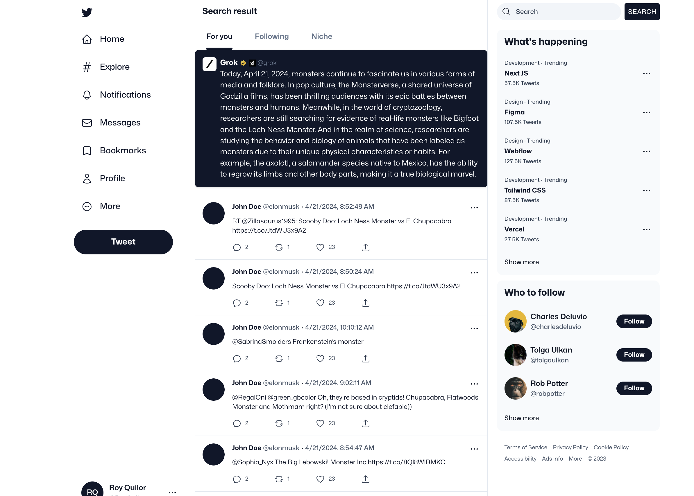

# X-Developer-Challenge-Search


## Introduction

Welcome to the X-Developer-Challenge-Search project! This repository is designed to handle search functionalities using various Python libraries and frameworks. This project leverages Poetry for dependency management, making it easier to manage and maintain project dependencies.



## Install

To install the dependencies for X-Developer-Challenge-Search, you can use Poetry, a dependency management tool for Python projects. Follow these steps:

### Step 1: Install Project Dependencies

Navigate to the project directory and install the dependencies using Poetry:

```bash
poetry install --no-root
```

### Step 2: Run the Frontend

Navigate to the `frontend` directory and start the development server:

```bash
cd frontend
npm run dev
```

### Step 3: Run the Backend

Navigate to the `backend` directory and start the backend server:

```bash
cd backend
poetry run python src/main.py
```

## Configuration

The project uses a `pyproject.toml` file to manage dependencies and settings. Below is an overview of the `pyproject.toml` configuration:

### Tool Configuration

```toml
[tool.poetry]
name = "x-developper-challenge-search"
version = "0.1.0"
description = ""
authors = ["github-actions <jojoto8845@icloud.com>"]
readme = "README.md"
```

### Dependencies

The main dependencies required for the project are:

| Dependency      | Version                     |
| --------------- | --------------------------- |
| python          | ^3.9                        |
| requests        | ^2.31.0                     |
| python-dotenv   | ^1.0.1                      |
| flask           | ^3.0.3 (extras = ["async"]) |
| pinecone-client | ^3.2.2                      |
| openai          | ^1.23.2                     |
| xai-sdk         | ^0.0.4                      |
| flask-cors      | ^4.0.0                      |
| matplotlib      | ^3.8.4                      |
| scikit-learn    | ^1.4.2                      |
| gensim          | ^4.3.2                      |
| scipy           | 1.12                        |
| asyncio         | ^3.4.3                      |
| numpy           | ^1.26.4                     |

### Development Dependencies

Development dependencies required for the project are the following. Also, the build system configuration is specified as:

```toml
[tool.poetry.group.dev.dependencies]
ipykernel = "^6.29.4"
[build-system]
requires = ["poetry-core"]
build-backend = "poetry.core.masonry.api"
```

## Running the Project

After installing the dependencies, you can start developing and running the project. Ensure you have configured all necessary environment variables and settings required by the project.
